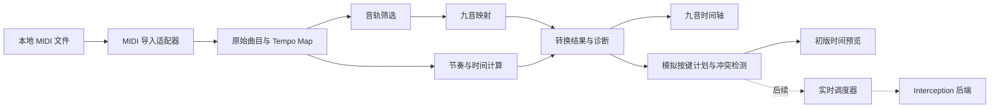

# RockAutoMusicPlay 初版设计方案

新增音符补充：已实现“添加音符”模式，点击九键行空白位置添加一拍、力度 100 的音符；可连续添加，Esc 退出。新音符加入指定可播放音轨，空 MIDI 可自动创建手工音轨。使用会话内稳定来源 ID 与编辑记录参与转换、试听、批量编辑及撤销重做，不参与原曲八度估计，不改写原始 MIDI。原规划中的音频试听、批量编辑和新增音符均已完成，后续范围以 README 为准。

批量编辑补充：时间轴已支持空白处拖动框选、Ctrl/Shift 追加、Ctrl 点击增减及 Ctrl+A 全选当前显示音轨。多选后可批量删除、拖动移动、拉伸左右端点，或通过 ↑/↓ 升降九键音级。整组使用同一时间/音级增量，受最早起点、最短时长及 B～U 音高边界共同约束；每次批量编辑作为一个撤销步骤。试听期间继续禁止编辑，隐藏音轨不参与框选。

版本：v0.1 · 日期：2026-09-20 · 状态：已实现首轮导入、九键转换与轨道显示

试听功能补充：已将原来的无声时间预览替换为 miniaudio 驱动的手碟采样试听。九键各 4 个原始采样来自用户提供的 SIFT 程序，保持 44.1 kHz 立体声并嵌入本程序；支持和弦、暂停/继续、停止、定位、音量与当前转换/编辑结果同步，使用音频采样时钟推进游标。音符结束后约 0.35 秒渐弱，采样约 3.70～4.39 秒、不循环，每键四个版本按时间轴顺序轮换；调速不变调。本文后续无声预览描述为原始阶段规划，当前实现以 README 的“手碟试听”为准，Interception 键盘输出仍未接入。

编辑功能补充：九键音符已支持新增、选中删除、点选删除模式、水平移动时间、垂直移动到其他目标键、两端拉伸，以及按曲目独立的撤销/重做。手工修改以来源 ID 对应的 tick/目标键覆盖记录保存在当前会话中，重新转换仍保留；编辑结果重新计算映射数量、和弦、同键合并、过密冲突和超出原曲的时长。原始文件保持不变。项目保存和导出仍未实现。

实施说明：根据后续“构建页面，先实现上传后转换成九键然后显示在轨道上”的要求，已交付 Qt 桌面工作台。本文保留完整设计目标；当前功能和运行方式以根目录 README 为准。首轮采用 QAbstractScrollArea + QPainter 批量绘制九键时间轴；已实现秒刻度，拍号网格和全曲缩略图尚未实现。未接入 Interception 实际发送按键。

## 1. 需求与范围

开发 Windows 本地桌面软件：导入 MIDI 文件，将音符转换为用户指定的九个固定音，最终由 Interception 输出键盘按键。

最初设计阶段交付本文档；后续已按用户指示进入上述首轮实现。参考图只用于理解布局和操作习惯，其中的按钮、文案和功能不自动成为本项目需求。

### 初版 v0.1：转换工作台

| 功能 | 设计范围 |
| --- | --- |
| 文件导入 | 顶部导入按钮及拖放，支持本地 `.mid` / `.midi`；不上传服务器 |
| 曲目栏 | 可导入多首曲目、切换当前曲目；每首独立设置，不做多首混音或串联播放 |
| 音轨控制 | 显示轨道与通道，启用/静音、独奏、查看数量；首版不编辑原始轨道顺序 |
| 九音转换 | 精确映射；不支持的音选择“转成相近音”或“跳过” |
| 音符总控制 | 转换策略、恢复默认、全部启用/静音、重新转换、全曲/当前音轨显示 |
| 九音控制台 | 九行音符时间轴、缩放、滚动、定位、音符详情；支持查看原始音和目标音 |
| 节奏控制 | 原曲速度/固定 BPM 二选一、播放倍率、时间轴节拍线；默认不量化音符 |
| 结果检查 | 准确映射（含八度适配）、近似、跳过、排除、同键重合与同键过密统计，支持按原因定位 |
| 时间预览 | 手碟采样试听，开始/暂停/停止、当前时间/总时长；不输出系统按键 |
| 按键参数 | 显示并用于模拟检查的按下时长、同键最小间隔；不安装驱动也能使用 |

实际按键弹奏、非八度自动选调/移调、逐音八度折叠、片段拼接、项目持久化、导出 MIDI/键谱安排在后续迭代。整体自动八度适配、音频试听、批量编辑与新增音符已实现。初版保留会话内设置及手工编辑，关闭程序后不恢复项目，不展示尚未实现的保存按钮。

## 2. 固定九音映射

以用户给定音高为准，软件统一采用 **C4 = MIDI 60** 的显示约定。其他软件可能使用不同八度名称，转换判断始终使用 MIDI 数字。目标九音不是连续的完整音阶，尤其 A2 到 E3 之间存在空缺。

| 键盘键 | 显示名称 | 目标音高 | MIDI 音符编号 |
| --- | --- | --- | --- |
| T | 高音 1 | C4 | 60 |
| Y | 高音 2 | D4 | 62 |
| U | 高音 3 | E4 | 64 |
| F | 3 | E3 | 52 |
| G | 4 | F3 | 53 |
| H | 5 | G3 | 55 |
| J | 6 | A3 | 57 |
| K | 7 | B3 | 59 |
| B | 低音 6 | A2 | 45 |

控制台按音高从上到下排列：**U、Y、T、K、J、H、G、F、B**。首版固定映射，不开放自定义按键。

## 3. 转换规则

### 3.1 输入与音符提取

1. 初版支持标准 MIDI 文件 SMF Format 0、Format 1，以及 PPQ tick 时间制。
2. Format 2、SMPTE 时间制、损坏文件、伪装扩展名的非 MIDI 文件明确报错，不猜测解析。
3. 保留文件轨道、通道、名称、乐器信息、速度事件、拍号事件以及原始音符编号。
4. 音符由 Note On / Note Off 配对；velocity=0 的 Note On 按 Note Off 处理。
5. 配对按原始轨道、通道、音高隔离。同一组重叠 Note On 按 FIFO 配对，并提示存在重叠歧义。
6. 缺少 Note Off 的音符在所属轨道结束处截断并记录警告；孤立 Note Off 忽略并计数；持续时间不为正的音符列为无效并排除。
7. Format 0 中的多通道拆成“轨道 × 通道”显示行。仅有节奏元事件的轨道不显示为可弹奏音轨，但仍参与全局时间计算。
8. 对遵循 GM 的文件，通道 10 通常为打击乐；初版把该通道标为“可能是打击乐，默认排除”，允许用户手动启用，不假定全部文件均为 GM。
9. 首版用离散音符音高进行转换，不把弯音、调音、延音踏板和表情控制器转换成九音演奏效果；相关事件存在时显示说明，原始数据仍保留。

### 3.2 精确映射与相近音

目标集合 S = {45, 52, 53, 55, 57, 59, 60, 62, 64}。

默认先进行整体八度适配：统计当前启用且符合独奏选择的原始音符，对 −120 到 +120 半音的 12 半音整数倍偏移计算到目标集合的误差平方和，选择最小者。并列优先偏移绝对值小者，仍并列取较低音域；无参与音符时为 0。全曲共用一个偏移，保持近似前的音程关系，不逐音折叠。手工修改/删除不参与偏移估计，手工目标键覆盖自动结果。用户可关闭适配，保持原始音高。

以下规则中的 p 指八度适配后的音高；准确映射不再仅表示原始绝对音高未变。

- 原音 p 属于 S：保留音高，并得到对应键。
- 原音不属于 S，策略为“跳过”：生成带原因的跳过记录，不生成目标音符。
- 原音不属于 S，策略为“转成相近音”：在 S 中选择半音距离 |p−s| 最小的目标音。
- 距离相同：固定选择较低音，保证结果可预测、可重复。
- 低于 A2 / 高于 E4：最近音模式映射到端点 A2 / E4；跳过模式仍跳过。
- 不逐音折叠八度。整体适配为 −12 半音时，C5 变成 C4；关闭适配时，C5 按绝对距离变成 E4 或跳过。
- 近似偏移显示为“目标 MIDI − 原始 MIDI”；偏移绝对值超过 12 半音时另作明显提示，不偷偷改变策略。

**默认值：自动八度适配 + 转成相近音。** 界面显示当前整体偏移，并说明宽音域仍可能需要简化。用户可关闭适配，或对适配后仍不支持的音选择跳过。

下表展示关闭八度适配时的绝对音高规则：

| 原始音 | MIDI | 相近音模式 | 跳过模式 |
| --- | --- | --- | --- |
| C4 | 60 | T，精确保留 | T，精确保留 |
| F♯3 | 54 | G / F3，等距取低 | 跳过 |
| C♯4 | 61 | T / C4，等距取低 | 跳过 |
| C3 | 48 | B / A2，距离 3 半音 | 跳过 |
| D3 | 50 | F / E3，距离 2 半音 | 跳过 |
| C5 | 72 | U / E4，距离 8 半音 | 跳过 |
| C2 | 36 | B / A2，距离 9 半音 | 跳过 |

### 3.3 多键和弦、同键合并与重复按键

音高转换阶段保留所有有效音符及其开始时间，不把和弦强制改成单音旋律，不把多个音符静默删除。

Interception 支持分别发送每个扫描码的 Key Down / Key Up，`interception_send` 也可一次提交多个 stroke。因此程序可以在同一调度批次中按下多个不同键，并在按下时长结束后再释放；这段时间内多个键同时处于按下状态。API 提交仍有事件顺序，不承诺物理意义上的绝对同一纳秒，但对本项目应作为一个和弦时刻处理。

模拟按键计划按以下规则处理：

- 不同键同一时刻：保留为同一和弦组；将全部 Key Down 放入同一批次，达到按下时长后再批量发送对应 Key Up。不同键彼此重叠不属于按键过密，也不受“同键最小间隔”限制。
- 不同键开始时间接近或按住时间重叠：照常保留，可同时维持最多九个目标键的按下状态，不为了错峰而移动任何音符。
- 相同键同一时刻：合成一次按键触发，关联全部来源音符，显示“同键重合”。
- 同一时刻按源绝对 tick 判断，不用显示层四舍五入后的秒数去重。
- 同一键不同开始时间：保留重复触发意图。第二次 Key Down 前必须先完成该键的 Key Up；若两次开始时间之差小于“按下时长 + 同键最小间隔”，才标记为“同键过密冲突”。
- 当前存在同键过密冲突时禁止音频试听，点击播放弹窗说明冲突数量与处理方法，音频引擎也拒绝播放冲突结果。不通过推迟音符破坏节奏，也不擅自删音。用户需调整速度/触发参数，或手工移动、删除音符，重新转换并消除冲突后才能试听；不同键的和弦不阻止试听。
- “同键最小间隔”指上一次松开到下一次按下之间的时间；不限制不同键，因此不会把和弦自动拆开。
- 时间轴块宽度表示 MIDI 音符持续时间，模拟按键采用固定按下时长；两者分别显示。

Interception 能力本身不再作为多键和弦的阻碍；P3 实机验证只确认目标游戏是否接受九键组合、同批次事件顺序以及实际调度误差。若目标游戏限制和弦，作为兼容性诊断报告，不回退为全局错峰规则。

### 3.4 转换统计

针对所有有效解析音符，先按轨道启用状态筛选：有独奏时只取已启用的独奏行，否则取全部已启用行；静音始终优先。

- 全曲有效音符 = 本次参与转换 + 音轨排除。
- 本次参与转换 = 精确保留 + 近似转换 + 策略跳过。
- 目标音符数 = 精确保留 + 近似转换。
- 按键触发数 = 目标音符数 − 同时同键合并减少量；仅同一个目标键的过密冲突单列，不减入转换成功数。
- 损坏/无效事件、被截断音符另列导入诊断，不混同于“无法映射”。

显示“已映射”“多键和弦数”及“同键过密冲突”。不同键的同时按下不显示为冲突；目标游戏兼容性尚未实测时另示“和弦待实机验证”。

## 4. 节奏、BPM 与按键设置

### 4.1 时间计算

原始 tick 为唯一来源；内部派生时间采用整数微秒或等精度表示，界面秒数只用于展示。

- **跟随原曲（默认）**：读取全曲 tempo map，逐段积分得到时间；首个速度事件前使用 500,000 微秒/四分音符，即四分音符 BPM 120。
- 对每一速度区间，区间耗时 = 区间 tick 数 ÷ PPQ × 该区间每四分音符微秒数。
- 同时刻速度事件冲突时，优先原始第 0 轨；同轨取事件顺序中最后一项；无第 0 轨时取最低轨号，并记录冲突说明。
- **固定 BPM**：由用户指定四分音符 BPM，忽略原曲速度变化，时间 = tick ÷ PPQ × 60 ÷ BPM。界面明确提示“将覆盖原曲变速”。
- **播放倍率 r**：在所选时间模式计算完成后统一除以 r；开始时间与音符持续时间都随之缩放，音高不变。
- 保留曲首空拍，不默认把第一个音符移动到 0 秒。
- 拍号影响小节线和节拍网格；BPM 在本软件中固定以四分音符为单位，不能把 6/8 的附点四分音符速度直接混用。
- 无拍号时显示 4/4；变拍号显示相应网格。网格仅辅助定位，首版不做自动对齐/量化。

### 4.2 设置规格

| 设置 | 初始值 / 建议范围 | 生效范围 |
| --- | --- | --- |
| 速度来源 | 跟随原曲 / 固定 BPM | 当前曲目 |
| 固定 BPM | 初始 120；20–400 | 仅固定模式可编辑 |
| 播放倍率 | 1.00×；0.25–3.00× | 当前曲目 |
| 按下时长 | 30 ms；1–1000 ms | 模拟按键计划，后续驱动复用 |
| 同键最小间隔 | 20 ms；0–1000 ms | 同键两次触发，不作用于不同键 |
| 不支持音符 | 转成相近音 / 跳过 | 当前曲目全部参与音轨 |

范围是产品输入约束，不代表驱动或目标程序可稳定达到的性能。按下时长与间隔以真实毫秒计，不随倍率变化；倍率变更后必须重算冲突。

使用一个明确的“应用设置”按钮：音高策略改变重算映射，节奏改变重算时间和按键计划，避免多个重复“确认”按钮。未应用时显示“有未应用设置”，预览始终使用上次已应用版本。

## 5. 界面结构

采用简洁的浅灰背景、白色工作区、青绿色主要操作；近似音用琥珀色，跳过用灰色加符号，冲突用红色图标。状态同时提供文本，不能只用颜色表达。

建议默认窗口 1440 × 900，最小 1100 × 720；使用可调整分隔栏和 DPI 缩放，九音工作区优先占据宽度。

```text
┌ RockAutoMusicPlay ──────────────────────────────────────────────────┐
│ [导入 MIDI]  当前曲目：示例.mid             3 轨 · 256 音 · 01:24     │
├─────────────┬─────────────────────────────────┬────────────────────┤
│ 曲目        │ 音符总控制                       │ 全局 / 音轨 / 音符 │
│ ▸ 示例.mid  │ [重新转换] [全曲▾] [查看全部]    │                    │
│   第二首    │ 映射 230 · 跳过 26 · 冲突 2     │ 不支持的音符       │
│             ├─────────────────────────────────┤ 相近音 ○ / 跳过 ○  │
│ 当前曲目音轨│ 音轨概览 / 全曲缩略时间轴         │                    │
│ ☑ 旋律 M S  ├─────────────────────────────────┤ 速度：跟随原曲 ▾   │
│ ☑ 和声 M S  │ 秒 / 小节:拍   0   1   2   3   │ BPM    播放倍率    │
│ ☐ 打击乐    │ U · E4       ━━                 │ 120    1.00×       │
│             │ Y · D4             ━━           │                    │
│             │ T · C4    ━━━                   │ 按下时长 / 同键间隔│
│             │ K · B3              ━           │ 30 ms / 20 ms      │
│             │ J · A3      ━━                  │ [应用设置]         │
│             │ H · G3                          │                    │
│             │ G · F3          ━               │ 选中音符摘要       │
│             │ F · E3    ━                     │ F♯3 → F3 / G       │
│             │ B · A2                 ━━       │ 近似：降低 1 半音  │
├─────────────┴─────────────────────────────────┴────────────────────┤
│ [时间预览] [暂停] [停止]  00:12 / 01:24       缩放 [−] ━━━ [+]       │
│ 诊断：2 个同键间隔冲突 [查看详情]               预览不发送键盘事件     │
└────────────────────────────────────────────────────────────────────┘
```

### 操作细节

- 顶部以导入为主要入口，不堆叠首版未实现的导出、复制、撤销等按钮。
- 左栏区分“文件曲目”和“当前文件音轨”；M 为静音，S 为独奏，提供中文悬浮说明。
- 中央上方为全局控制与统计，下方是可切换的全曲概览和九音时间轴。音轨显示过滤仅影响视图，不等同于静音或转换范围。
- 右栏分成“全局 / 音轨 / 音符”选项卡，避免将所有参数挤在一条很长的滚动面板中。
- 选中音符显示原始音高、目标音高、按键、来源轨道/通道、起始与持续时间、原始力度、转换原因和偏移。力度只作为来源信息，不暗示普通键盘可表达 MIDI 力度。
- 跳过音符没有合法九音行，在可折叠的“未映射事件”条带和诊断列表展示；点击记录定位时间，不能伪装成某一可弹音。
- 原始完整音高通过详情与可选对照视图查看，不把所有原音挤入九音行。
- 导入为空：显示“导入 MIDI 开始转换”；无有效音符：显示元事件/排除原因；所有音符跳过：显示可调整策略，预览按钮禁用。
- 导入/转换后台运行，可取消；失败保留之前成功导入的曲目。重新转换前停止时间预览，结果完成后原子替换。
- 各曲目使用独立修订号，过时任务结果不得覆盖用户切换或更新后的曲目。
- 当前版本无音频合成，按钮称为“时间预览”，不称为“试听”。

## 6. C++ 技术方案

### 技术选择

| 部分 | 拟用方案 | 选择理由 |
| --- | --- | --- |
| 语言与构建 | C++20、CMake、CLion | 延续现有模板，不另建语言栈 |
| 桌面 UI | Qt 6 Widgets | C++ 原生实现，适合桌面面板和表格 |
| 时间轴 | QGraphicsView / QGraphicsScene | 提供二维图元、缩放、选择和滚动能力；大文件时再实测批量绘制 |
| MIDI 解析 | craigsapp/Midifile，经适配层接入 | 已有事件时间分析、音符配对能力，具体边界按本方案补齐验证 |
| 核心转换 | 独立 C++ 模块 | 不依赖 UI、驱动，能够单独验证规则 |
| 按键输出 | Interception 适配器 | 后续发送键的按下/松开事件 |
| 初版预览 | 无输出后端 + 模拟按键计划 | 未安装驱动时也能完整完成转换和检查 |

Qt Graphics View 的能力依据 [Qt 官方说明](https://doc.qt.io/qt-6/graphicsview.html)。Midifile 提供时间分析及配对接口，依据 [作者文档](https://midifile.sapp.org/)。实现前固定实际依赖版本和编译器组合，不在设计阶段下载依赖。

### 模块关系



### 数据边界（概念设计，非代码）

| 对象 | 核心内容 |
| --- | --- |
| SourceSong | 源路径、SMF 格式、PPQ、轨道、Tempo Map、拍号图、导入警告 |
| SourceNote | 稳定 ID、轨道、通道、pitch、velocity、startTick、endTick、配对诊断 |
| TrackSelection | 曲目内的轨道/通道启用状态、静音、独奏 |
| ConversionOptions | 最近音/跳过策略，固定九音映射版本 |
| TimingSettings | 原曲/固定 BPM、倍率、按下时长、同键最小间隔 |
| NoteMapping | 来源 ID、目标音与键或空值、映射状态、偏移、原因 |
| TimedNote | 来源 ID、派生起止时间、目标键、所属显示行 |
| KeyPlan | 同一调度批次的多键按下/松开、来源 ID 集合、同键合并与同键过密冲突 |
| ConversionReport | 各类计数、可定位的原因列表、使用的设置修订号 |
| SongSession | 当前选择、各项设置、上次应用结果和后台任务修订号 |

原始数据只读；所有转换和时间派生均可重算。音高映射、时间计算与物理按键约束保持独立，不能把来源音符直接替换成扫描码。

建议后续目录职责：`src/app` 负责会话协调，`src/ui` 负责界面，`src/core` 负责纯转换与时间计算，`src/midi` 负责文件适配，`src/playback` 负责计划与后续调度，`src/platform/windows` 负责 Interception，`tests` 放验收用例。当前不创建这些代码目录。

## 7. 后续 Interception 播放边界

这一节定义后续能力，不纳入 v0.1 运行依赖。

- 独立探测 DLL、驱动和目标键盘设备；未就绪时禁用“开始弹奏”，导入与转换继续可用。
- 使用九个键对应的物理扫描码，逐个验证按下、松开和键盘布局差异；不依赖字符输入来代替按键。
- 实际播放基于单调时钟和绝对截止时刻，避免连续相对 sleep 累积漂移；UI 刷新不承担实时发送。
- 同一时刻的不同目标键组成一个批次：一次提交全部 Key Down，按下时长结束时一次提交全部 Key Up，使和弦各键保持同时按下。
- 同一键需要在同一时刻重新触发时先发送该键 Key Up，再发送 Key Down；不同键不必为此松开。启动、暂停、停止、错误和正常结束有明确状态。
- 用户主动启动、短倒计时后发送；前台目标变化时暂停并尝试释放本次软件按下的键。Interception 输出是设备输入，不保证能向后台指定窗口弹奏。
- 暂停/停止/退出时清空待发送事件并释放本次程序持有的键；发送失败时尝试清理并报告，不能声称驱动故障后一定释放成功。
- 全局紧急停止键拟用 F8，与九个演奏键分开；注册失败时明确提示，实际播放阶段再验证。
- 不在转换过程中发送按键，不自动安装驱动；驱动安装作为独立用户操作提供指导。

Interception 官方头文件定义了独立的 Key Down / Key Up，并允许 `interception_send(..., nstroke)` 发送事件数组；官方 `caps2esc` 示例也使用数组发送多个键盘事件。由此可确认驱动接口能表达多键同时按住。[官方头文件](https://github.com/oblitum/Interception/blob/master/library/interception.h) · [官方 caps2esc 示例](https://github.com/oblitum/Interception/blob/master/samples/caps2esc/caps2esc.cpp)

官方仓库说明驱动安装需管理员命令行，并列出测试范围为 Windows XP–10；因此 Windows 11 和实际目标游戏兼容性仍需实机验证，不能预先承诺。[Interception 官方仓库](https://github.com/oblitum/Interception)

## 8. 实施顺序

| 阶段 | 工作 | 完成标准 |
| --- | --- | --- |
| P0 · 当前 | 需求、布局、规则、边界和用例设计 | 本文档，无业务代码 |
| P1 · 导入与转换核心 | MIDI 适配、时间图、九音映射、诊断 | 下面的核心用例可重复验证 |
| P2 · 初版工作台 | Qt 界面、曲目/音轨、九音视图、设置、时间预览 | 可完成导入→转换→检查的闭环；无需驱动 |
| P3 · 实际弹奏 | Interception 设备探测、调度、暂停/停止和释放 | 实机验证九键、和弦、密集音符与停止行为 |
| P4 · 后续完善 | 按优先级选择保存/导出、音符编辑、移调和试听 | 另立范围，不挤入转换初版 |

## 9. 初版验收用例

| 用例 | 预期 |
| --- | --- |
| 九个目标音依次输入 | 得到 B、F、G、H、J、K、T、Y、U，无近似 |
| F♯3、C♯4 输入 | 最近模式分别得到 G、T；跳过模式得到两个跳过记录 |
| C3、D3 输入 | 最近模式分别得到 B、F，验证目标集合的低音缺口 |
| 关闭八度适配，C5 与 C2 输入 | 最近模式为 U、B，不逐音折叠 |
| 用户《加勒比海盗》MIDI | 自动整体 −12 半音，241 个按键逐项匹配用户参考谱，U 键 35 个 |
| PPQ=480，120 BPM，tick=480 开始且持续480 tick | 开始0.5秒、持续0.5秒 |
| tick=480 从120 BPM改为60 BPM，音符从tick=240到720 | 开始0.25秒、结束1.0秒、持续0.75秒 |
| 上述变速文件改为固定120 BPM | 相同音符开始0.25秒、结束0.75秒 |
| 所有时间以2.00×预览 | 开始和持续时间减半，音高不变，固定按键毫秒参数不变 |
| C4与D4同tick开始 | T和Y作为一个批次同时按下并保持，不计为过密，不因20 ms间隔拆开 |
| 九个目标音同tick开始 | 九个 Key Down 属于同一和弦批次，九键可同时保持；生成一个对应 Key Up 批次 |
| T在0 ms、Y在10 ms触发，均按下30 ms | 两键在10–30 ms重叠按住，不报告过密冲突 |
| C4与C♯4同tick开始，最近模式 | 两个来源音符映射为T，按键计划合为一次并记录来源 |
| T在0和40 ms触发，按下30 ms、同键间隔20 ms | 报告同键过密冲突；0和50 ms触发不冲突；不移动原始开始时间 |
| 切换静音/独奏与显示过滤 | 静音/独奏改变参与范围；单纯显示过滤不改变转换统计 |
| Note On速度0、同音重叠、缺Note Off | 按既定规则解析、配对或截断，诊断可定位 |
| 静音带Tempo事件的轨道 | 仍保留该轨道对全曲时间的影响 |
| 不支持的SMF类型或损坏文件 | 有明确错误，已有曲目不被破坏 |
| 空文件曲目 / 全部跳过 / 全部排除 | 明确空状态，不崩溃，不启动空预览 |
| 重复转换或切换策略再切回 | 原始数据不变，相同设置产生相同结果 |
| 导入大曲目后取消、快速切换曲目 | UI仍可响应，旧任务不覆盖新结果 |
| 没有安装Interception | 全部初版转换、设置、时间预览功能可运行 |

性能验证暂以10万有效音符为压力样本，记录导入时间、转换时间、内存和缩放响应，再决定绘制优化与资源上限；不在没有基准测试时承诺时延。文件读取必须校验块边界、事件长度和数值溢出，对过大输入提供取消与明确错误。

## 10. 已采用的设计假设

以下为便于后续实施所采用的默认选择，不视为用户新增要求：

1. Windows桌面应用、C++20和Qt Widgets；初版不做网页界面。
2. C4按MIDI 60解释，以用户给定九音为绝对目标音高。
3. 无法映射默认取最近音，等距取低；支持切换为跳过。
4. 初版先完成可视化转换，不发送键盘事件，不做音频试听。
5. 先保留全部启用音轨的复音；不自动识别主旋律或自动移调。
6. 30 ms按下、20 ms同键间隔来自参考图，用作可调整初始值，后续实测再校准。

## 11. 技术参考

- [Standard MIDI Files — MIDI Association](https://midi.org/standard-midi-files)：文件格式规范入口。
- [MIDI note 60 与八度命名讨论 — MIDI Association](https://midi.org/community/midi-software/middle-c-note-60-pitch-assignment)：八度标签存在约定差异，因此本项目明确固定显示约定。
- [Midifile 作者文档](https://midifile.sapp.org/)：C++ MIDI解析、时间分析和音符配对接口。
- [Qt Graphics View Framework](https://doc.qt.io/qt-6/graphicsview.html)：二维图元、缩放和交互能力。
- [Interception 官方仓库](https://github.com/oblitum/Interception)：API、安装要求和官方说明的测试范围。发布阶段再核对所采用版本的依赖许可及分发要求。
- [Interception 官方头文件](https://github.com/oblitum/Interception/blob/master/library/interception.h)：Key Down / Key Up 状态与批量 `interception_send` 接口。
- [Interception caps2esc 示例](https://github.com/oblitum/Interception/blob/master/samples/caps2esc/caps2esc.cpp)：官方示例中的键盘事件数组发送方式。
